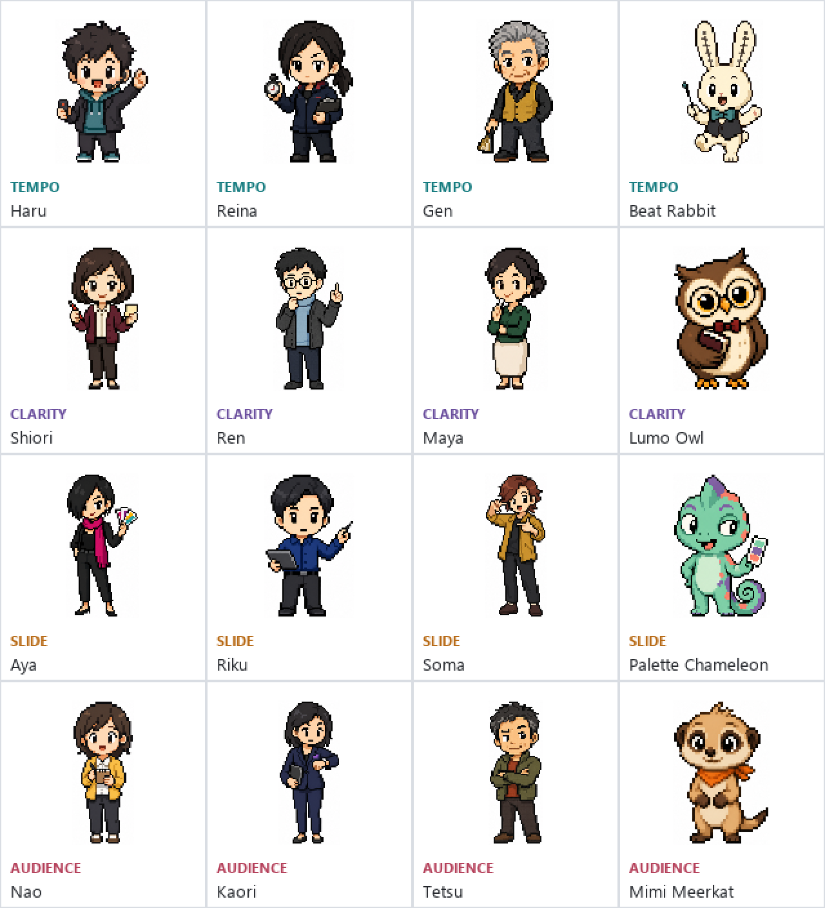

# 審査員キャラクター案

透明オーバーレイに表示する4人の審査員について、Codexのペットに近い小さなピクセルアートとして各4案を作成しました。個別画像は128 x 128 px、コンパクトな頭身、少ない色数、1〜2 px程度の輪郭を基準にしています。

| 担当 | 人物案 | 動物案 |
| --- | --- | --- |
| プレゼンのテンポ | Haru / Reina / Gen | Beat Rabbit |
| 説明の明快さ | Shiori / Ren / Maya | Lumo Owl |
| スライドの内容 | Aya / Riku / Soma | Palette Chameleon |
| 観客代表 | Nao / Kaori / Tetsu | Mimi Meerkat |

## ファイル

- `*-128.png`: 128 x 128 pxの個別キャラクター案
- `judge-concepts-pixel-128-contact-sheet.png`: 16案の実寸一覧
- `judge-concepts-pixel-128-contact-sheet-preview.png`: 2倍のニアレストネイバー表示

現時点ではデザイン選定用の基準画像です。各担当から1案を選定したあと、背景透過と「通常・喜ぶ・困る・驚く・退屈」などの表情・動作スプライトを同じデザインから制作します。
